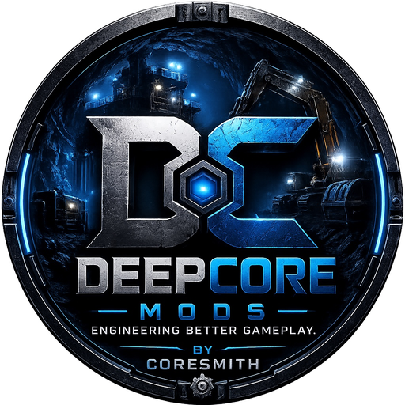

# ⚙️ DeepCore Mods

### Engineering Better Gameplay.

---

## Hi, I'm C0reSmith 👋

Developer behind **DeepCore Mods**

Building reliable software, practical tools, and immersive game modifications.

---

## 🚀 Current Projects

### 🎮 DeepCore Mods

Creating game modifications with a focus on performance, stability, and player experience.

Current work includes:

- Gold Mining Simulator mods
- BepInEx plugins
- Gameplay improvements
- Quality-of-life features

---

### 💻 Software Development

Desktop applications developed with VB.NET and .NET.

Projects include:

- Delta Database Maintenance Utility
- Icon Builder
- Development utilities

---

## 🛠 Technologies

| Languages | Frameworks | Tools |
|---|---|---|
| VB.NET | .NET 8 | Visual Studio |
| C# | Windows Forms | Git |
| XML | BepInEx | GitHub |
| Harmony | Unity | Microsoft Access |

---

## 📈 Currently Learning

- C# development
- Harmony patching
- Unity mod development
- GitHub workflows
- Software release management

---

## ⭐ Featured Project

### Delta Database Maintenance Utility

A Windows desktop application for:

- Microsoft Access database backups
- Backup verification
- Compact and repair
- Backup history
- Database restoration
- Activity logging

---

## 📫 Contact

**Email:** deepcoremods@gmail.com

---

## Engineering Better Gameplay.

**DeepCore Mods — by C0reSmith**

